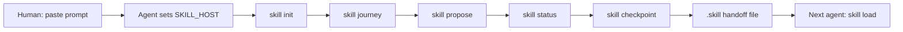
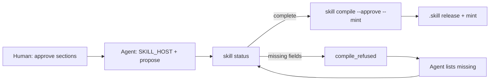
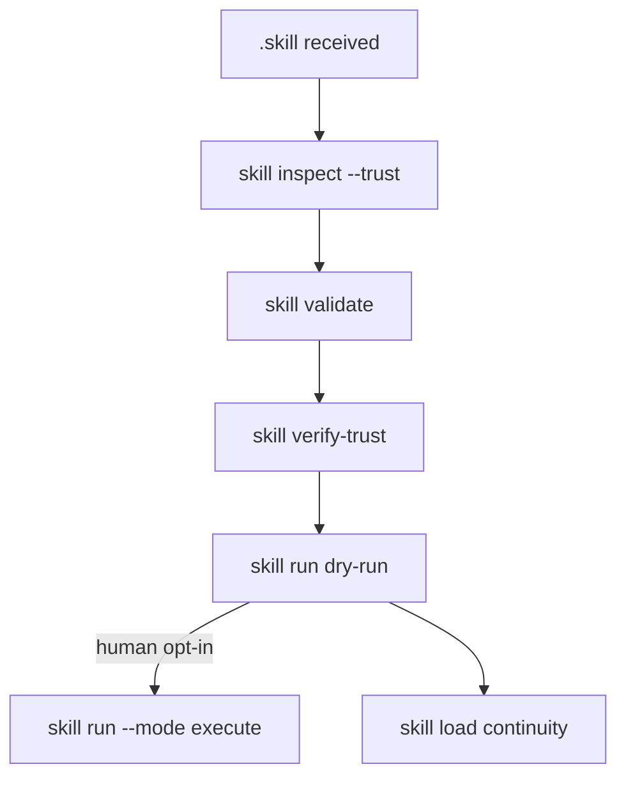
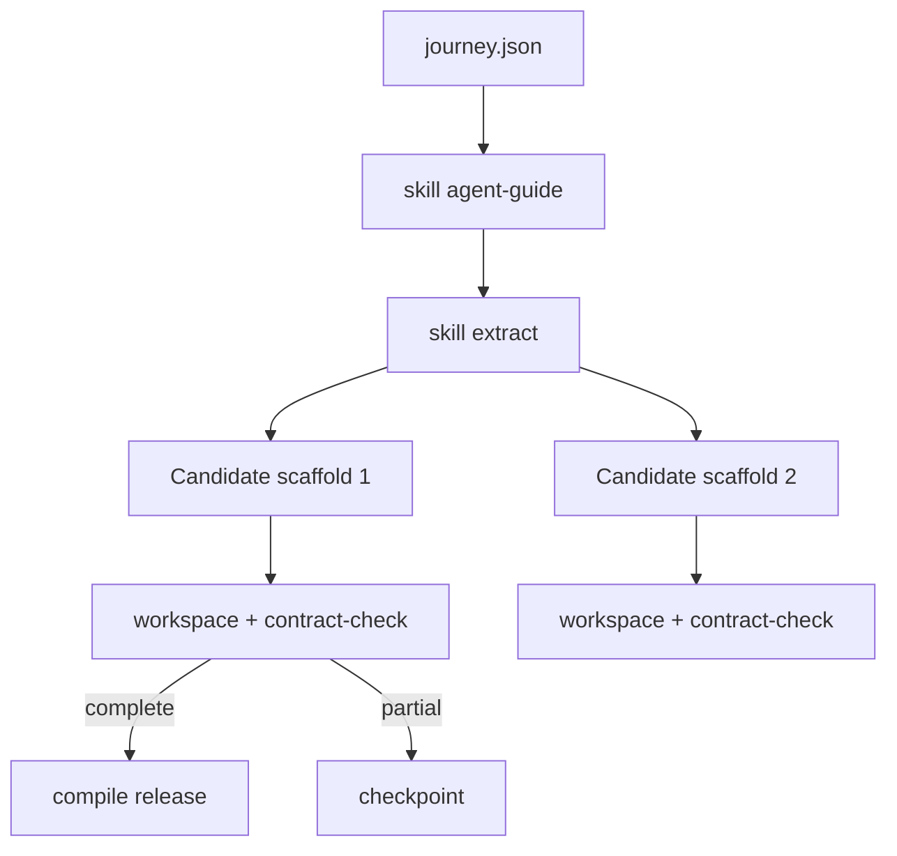
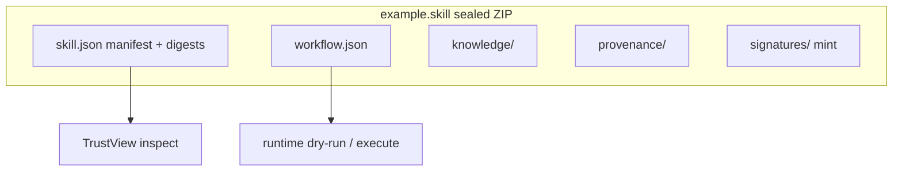

# Workflows

Visual maps for the agent-first create, handoff, and ingest paths. Humans paste prompts; agents run the reference CLI (or host libraries with the same contract).

## Create → continuity handoff

Mid-work packages are partial OK. No mint on continuity.

## Create → release

Release compile refuses incomplete contracts (`compile_refused`).

## Ingest safely

Inspect TrustView before any model reads package bodies or execute runs.

## Multi-skill identify

Segmentation is not compilation. One workspace per selected candidate.

## `.skill` anatomy

## Continuity vs release

| | Continuity draft | Release skill |
|---|------------------|---------------|
| Purpose | AI↔AI work handoff | Reusable sealed procedure |
| Incomplete? | Allowed (lists gaps) | **compile_refused** |
| Mint? | No | Yes (when complete + approved) |

Prompts: [Getting started](/getting-started) · Commands: [CLI](/cli) · Trust: [Trust and security](/trust-and-security)
